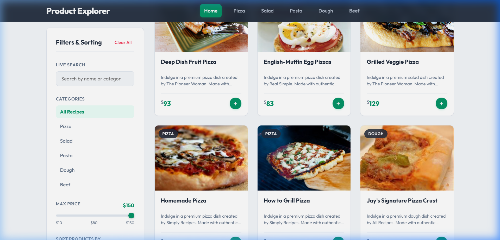
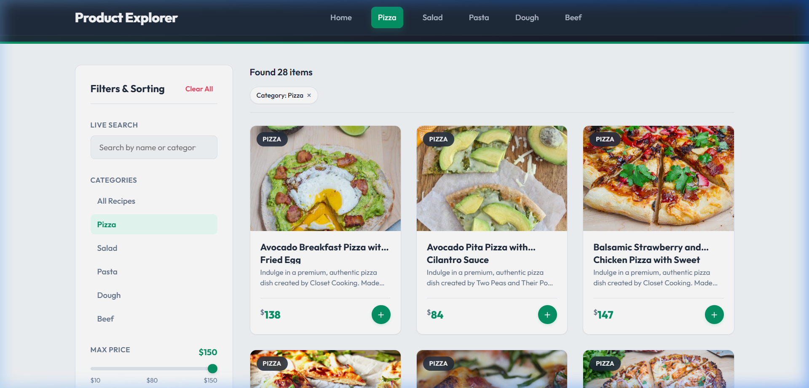
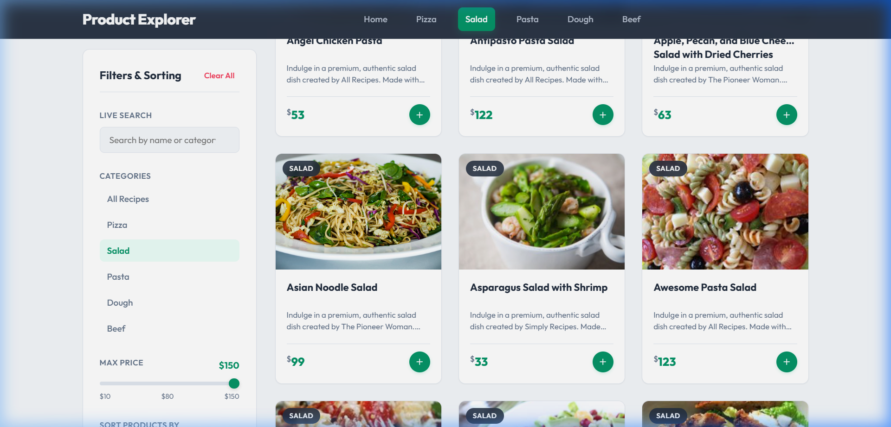
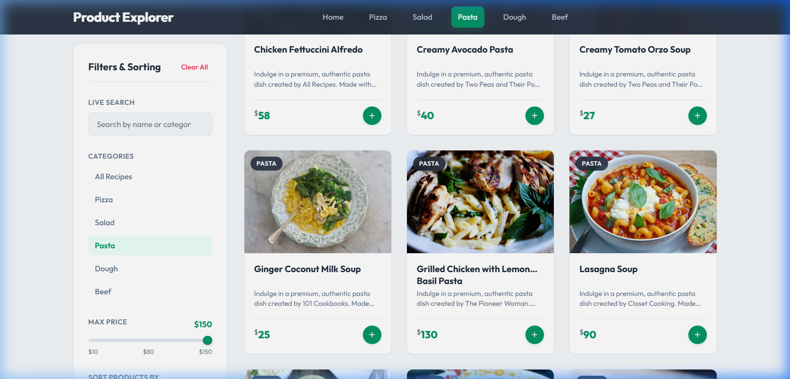
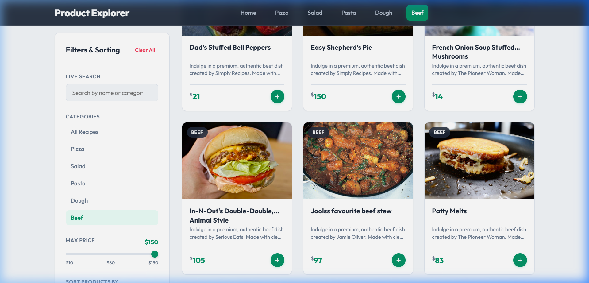
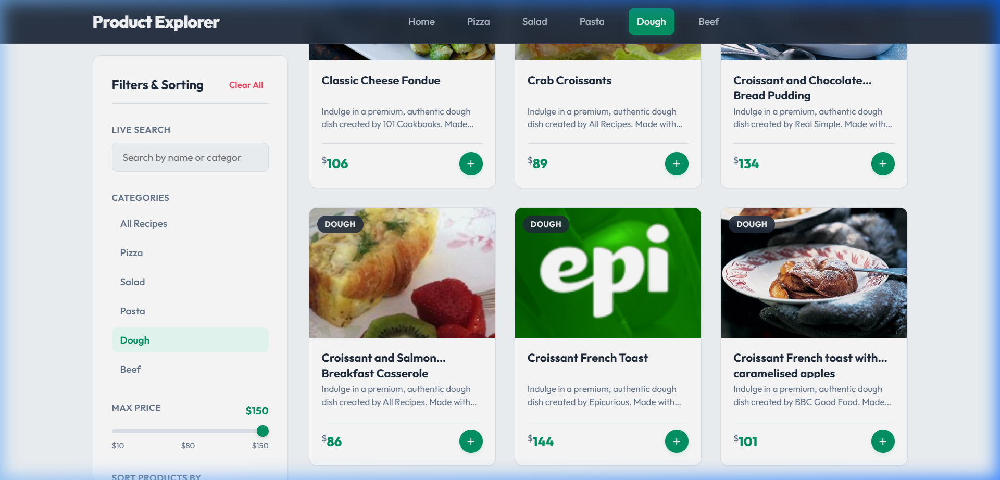
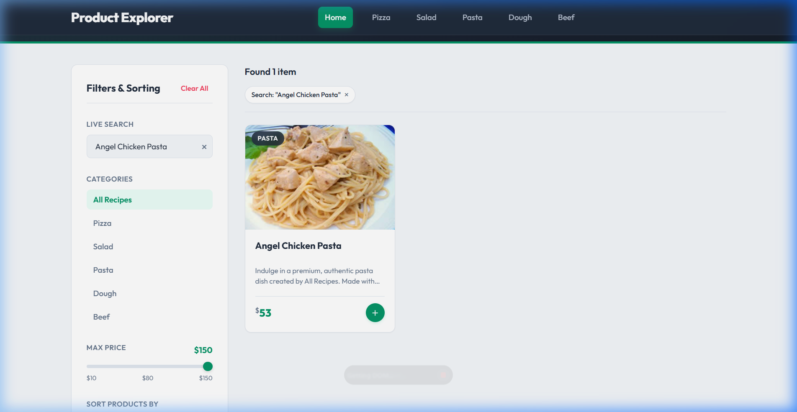
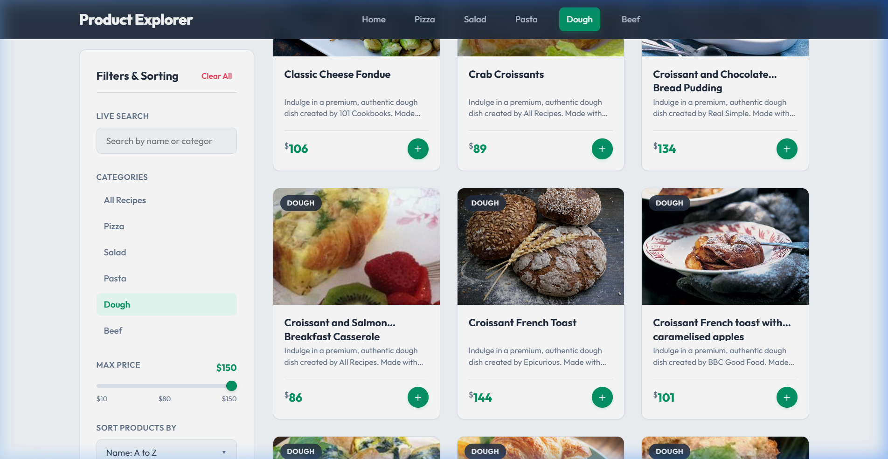
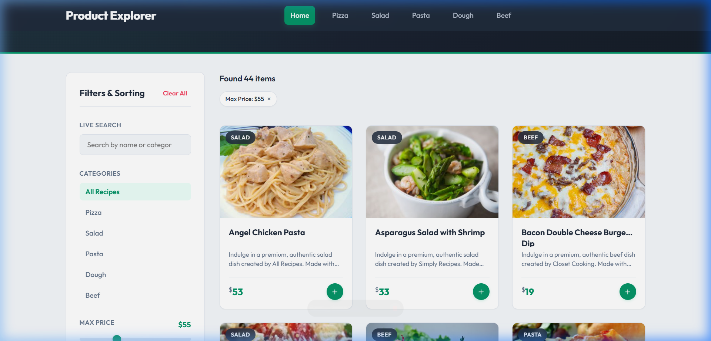
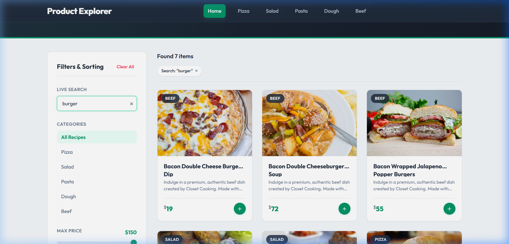

# Product Explorer: Advanced Product Search, Filter & Sort

A fully responsive, gourmet e-commerce product search and filtering application built using **Vanilla JavaScript (Advanced ES6+), HTML5, and CSS3** (no external frameworks or CSS libraries like React, Angular, Vue, Bootstrap, or jQuery).

This application integrates with the Forkify API, fetches recipe datasets exactly once during initialization, caches the result in-memory, and runs all search, category tag, price slider, and sorting queries completely client-side.

---

## 📸 Screenshots Showcase

Here are the visual screens captured during the testing phase (saved in the repository under [assets/screenshots/](assets/screenshots/)):

### 1. Main Dashboard (Initial Load)
Shows the unified grid displaying all 136 recipes, matching count, and initial analytical indicators.


### 2. Category Sourcing Verification
Each category accurately maps and returns products belonging to that category only:
*   **Pizza**: Pizza recipes only (e.g. Avocado Breakfast Pizza)
    
*   **Salad**: Salad recipes only
    
*   **Pasta**: Pasta recipes only
    
*   **Beef**: Beef/Steak recipes only
    
*   **Dough**: Bakery/Croissant recipes only
    

### 3. Category Override Correction (Self-Correcting Data)
Angel Chicken Pasta is returned from the API under the `salad` query. Our keyword sifter overrides it and correctly places it under **Pasta**:


### 4. Placeholder Image Interception
Unappealing publisher placeholders (like the green Epicurious logo) are intercepted and replaced with high-quality category food photography:


### 5. Price & Query Filters in Action
*   **Price Filtered at $55**:
    
*   **Live Search matching "burger"** (returns 7 matching beef recipes):
    

---

## 🛠️ Step-by-Step Implementation Details

This project was built incrementally using professional pair programming guidelines. Below is the step-by-step history of every single action taken to build and refine the repository:

### Step 1: Layout & Core Design Foundation (`index.html` & `css/style.css`)
*   Created a semantic HTML layout utilizing modern tags (`header`, `nav`, `main`, `aside`, `section`, `footer`).
*   Configured a premium design style guide using HSL color tokens to govern shadows, border-radii, light-to-dark transitions, glassmorphic control sidebars, and skeleton layouts.
*   Established a fully fluid grid system `grid-template-columns: repeat(auto-fill, minmax(260px, 1fr))` supporting responsive resizing on mobile, tablet, and widescreen viewports.

### Step 2: In-Memory Filter & Sorting Core (`js/filter.js`)
*   Built a pure, utility-driven filtering module based on ES6 array methods to process queries without mutative side-effects:
    *   **`filter()` & `includes()`**: For multi-condition searches (query terms, active categories, price thresholds).
    *   **`sort()`**: Alphabetical sorting (A-Z / Z-A) and numerical price sorting (Low to High / High to Low). Implemented non-destructively by cloning the array using the spread operator (`[...products].sort()`).
    *   **`reduce()`**: Computes the average price of current visible items dynamically.
    *   **`every()`**: Evaluates whether all visible cards meet the current budget limit.
    *   **`some()`**: Checks if there are premium options (>= $60) in the selection.

### Step 3: API Fetching & Normalization (`js/api.js`)
*   Implemented a unified endpoint fetching layer.
*   Mapped raw data objects returned from the public API into structured product instances containing fields: `id`, `name`, `category`, `price`, `image`, `description`, `publisher`, and `socialRank`.

### Step 4: UI Rendering, Event Triggers & LocalStorage Persistence (`js/ui.js` & `js/app.js`)
*   Built the rendering manager to draw product cards using template literals, cache DOM query selections, update stats blocks, and print pill chips for active filter labels.
*   Configured event listeners inside `app.js` for sliders, navbar category menus, dropdowns, and clear buttons.
*   Added an input **debounce utility** (250ms) to ensure smooth key-typing searches.
*   Wrote state synchronization logic with **`localStorage`**, guaranteeing that the user's category, price range, and sorting choices persist after reloading the browser page.

### Step 5: Branding Removal & Unique Price Variation
*   Removed all references to "BiteCraft" and the green logo icons, replacing them with a minimal and clean design called **Product Explorer**.
*   Updated price range bounds to **$150** max.
*   Created a seeded pseudo-random number generator (PRNG) to perform a **deterministic Knuth-Fisher-Yates shuffle** of linearly interpolated prices from **$10 to $150**. This ensured every product received a completely unique, realistic price that remains stable on reload.

### Step 6: Multi-Query Category Sourcing Fix
*   Identified that pulling only pizza recipes resulted in faked categorization.
*   Replaced the single-fetch method with parallel calls (`Promise.all`) fetching from category-specific API endpoints: `pizza` (Pizza), `salad` (Salad), `pasta` (Pasta), `beef` (Beef), and `croissant` (Dough).
*   Merged the queries into a single cached list of **136 products**, tag-matching recipes with their actual categories.
*   Prepended the category name to each recipe ID (e.g. `id: "${category.toLowerCase()}_${recipe.recipe_id}"`) to ensure absolute uniqueness across the combined array.

### Step 7: Title Keyword Category Refinement
*   Observed that the API returned recipes like *Angel Chicken Pasta* under its `salad` results.
*   Created a `refineCategory(title, currentCategory)` sifter to verify titles against keyword lists. If a title contains strong signals (like `pasta`, `salad`, `beef`, `croissant`, `pizza`), the sifter automatically overrides the query-assigned category, correctly moving *Angel Chicken Pasta* into **Pasta**.

### Step 8: unappealing Placeholder Interception
*   Epicurious recipes often return a generic green "epi" logo placeholder (`epicuriousfacebook511b.png`) instead of a food photo.
*   Wrote an image cleaner in `api.js` to detect placeholder keywords and replace them with high-quality category food photos from Unsplash.
*   Enhanced the image `onerror` handler in `ui.js` to degrade to category-specific fallback photos (e.g., fallback to a steak photo for beef cards, pasta photo for pasta cards) if an image fails to load.

---

## 📂 Project Structure

```
MeanStackDay2Task/
│── index.html          # Structural semantic HTML and inputs
│── css/
│     style.css         # Typography, responsive layout, animations, theme
│── js/
│     api.js            # Category fetches, unique price generator, placeholder fixes
│     filter.js         # Pure array filtering, sorting, stats calculation
│     ui.js             # DOM updates, card templates, statistic blocks, error fallbacks
│     app.js            # State controller, debouncing, localStorage sync, bootstrap
│── assets/
│     screenshots/      # Interactive test verification screenshots
```

---

## 🚀 How to Run the Project Locally

Since the application uses standard JavaScript modules and files, run it using a local HTTP server to avoid local filesystem path CORS policies in modern browsers:

1.  Open terminal (PowerShell, Command Prompt, or Bash) in the project root directory (`MeanStackDay2Task/`).
2.  Serve the folder using Python's built-in server:
    ```bash
    python -m http.server 8080
    ```
3.  Open your browser and navigate to:
    [http://localhost:8080/index.html](http://localhost:8080/index.html)
